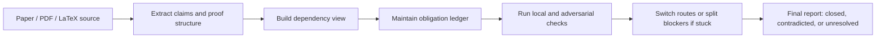

# LLM Math Reviewer

<p align="center">
  
</p>

<p align="center">
  Evidence-driven verification workflow for mathematical papers.
</p>

<p align="center">
  <code>Codex plugin</code>
  <code>LLM-driven</code>
  <code>Theorem paper review</code>
  <code>MIT</code>
</p>

`llm-math-reviewer` turns a general-purpose large language model into a more disciplined reviewer for theorem papers. Instead of stopping at "looks plausible," it forces the model to extract explicit claims, track dependencies, maintain an obligation ledger, try adversarial checks, and end with a bounded verdict.

> Best for dense mathematical papers where the real risk is premature acceptance, hidden assumptions, or unresolved proof steps.

## At A Glance

- Treats paper review as structured verification rather than summary.
- Extracts theorem-like claims and proof structure.
- Tracks dependencies and unresolved obligations explicitly.
- Forces alternate routes or smaller sub-obligations when a check stalls.
- Produces machine-readable artifacts and a human-readable final report.

## Why This Exists

General-purpose LLMs are often willing to stop too early, accept vague proof sketches, or settle for "probably correct." This plugin exists to counter that failure mode. It gives the model a stricter review process so it keeps moving until claims are verified, contradicted, or explicitly left open with recorded blockers.

## Workflow Overview



## What Makes It Different

- The LLM is still the main reasoning engine, but it is constrained by a verification-oriented workflow.
- Review targets are kept explicit instead of being buried in prose.
- Stall states are treated as workflow failures that must be decomposed, rerouted, or reported honestly.
- Final language is constrained to reduce overclaim.

## Good Fit

| Good fit | Not designed for |
| --- | --- |
| theorem papers with dense proofs | lightweight expository notes |
| papers with many intermediate lemmas | generic literature summarization |
| situations where hidden dependencies matter | automated public accusation workflows |
| careful review support for humans | replacing mathematical judgment |

## Outputs

Typical outputs include:

- extracted claims and proof structure
- dependency and risk views
- an obligation ledger for unresolved steps
- adversarial or local verification notes
- a final human-readable report

## Usage Note

For difficult papers, this plugin works best when the model is allowed to use the highest reasoning setting available. Lower reasoning settings are more likely to stop early, compress obligations too aggressively, or miss subtle dependency and citation issues.

## Example Prompts

- `Review this math paper and extract its core claims.`
- `Build an obligation ledger for this theorem paper.`
- `Check this proof for hidden assumptions or citation mismatch.`

## Practical Note

We have tested this workflow on a small number of papers that were later associated with published corrections or errata. In those cases, the plugin was able to surface parts of the argument that merited further scrutiny and, in practice, pointed toward the sections that eventually required correction.

In limited testing, we have also seen cases where parts of a preprint highlighted by the workflow were later revised, clarified, or expanded in subsequent versions. We do not draw case-by-case conclusions from such observations, but they suggest that the workflow can sometimes identify sections of an argument that deserve closer review.

To avoid unnecessary controversy, this repository does not include case-by-case results or name specific papers.

## Disclaimer

- This plugin is a review aid, not an automated authority on mathematical correctness.
- Its outputs should be treated as structured review targets, not as final judgments, unless decisive evidence is explicitly recorded.
- A flagged step, unresolved obligation, or failed verification path does not by itself establish that a theorem or paper is false.
- Tool failure, parser failure, or formalization failure should be interpreted as workflow limitations unless they directly expose a mathematical contradiction.
- Human mathematical judgment remains necessary, especially for compressed arguments, domain-specific techniques, and borderline cases.
- This repository is intended for methodological experimentation and careful review support, not for making public accusations about specific papers or authors.

## Installation

There are two installation paths.

### Option 1: Let Codex Install It

1. Clone this repository to a local plugin path such as `~/plugins/llm-math-reviewer`.
2. Tell Codex to install the plugin from that local path.

Example:

```text
Install the plugin at ~/plugins/llm-math-reviewer
```

### Option 2: Install It Manually

1. Clone this repository.
2. Put the repository at `~/plugins/llm-math-reviewer` or another local plugins directory.
3. Make sure your Codex plugin marketplace includes an entry pointing to `./plugins/llm-math-reviewer`.
4. Reload Codex or reinstall the plugin so the updated manifest and skill files are picked up.

<details>
<summary>Example marketplace entry</summary>

```json
{
  "name": "llm-math-reviewer",
  "source": {
    "source": "local",
    "path": "./plugins/llm-math-reviewer"
  },
  "policy": {
    "installation": "AVAILABLE",
    "authentication": "ON_INSTALL"
  },
  "category": "Productivity"
}
```

</details>

## Repository Layout

```text
.codex-plugin/plugin.json
skills/llm-math-reviewer/SKILL.md
skills/llm-math-reviewer/agents/openai.yaml
skills/llm-math-reviewer/references/math-review-sop.md
```

## Development

The main workflow lives in `skills/llm-math-reviewer/SKILL.md`. The plugin is intentionally instruction-heavy: it emphasizes explicit obligations, adversarial checks, anti-overclaim discipline, and forward motion when a proof review gets stuck.

## License

MIT
